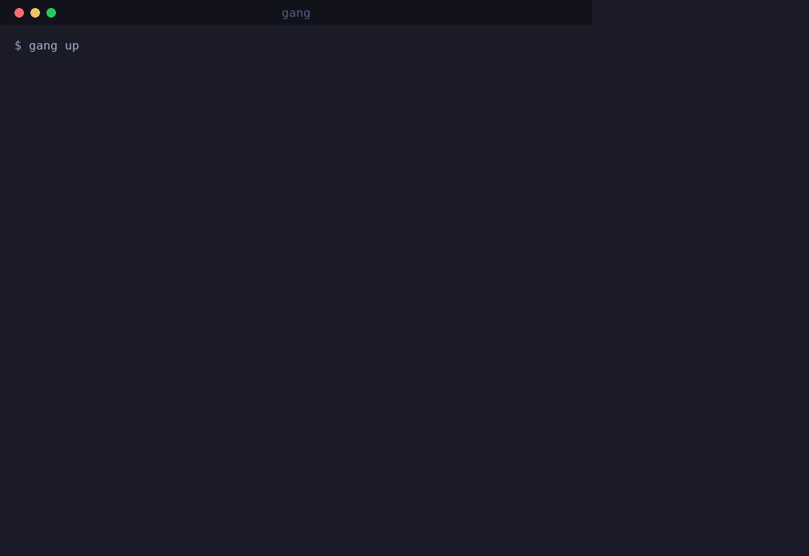

# Ganglion

Secure connectivity and auditable tool execution for ROS 2 robot fleets on hostile networks — outbound-only reachability, signed WASM tooling, default-deny policy.

 [](https://crates.io/crates/gang) [](LICENSE)


Ganglion is the secure connectivity and auditable tool-execution substrate for reaching robots deployed inside customer networks you don't own and can't configure. It is not a fleet management platform, not a robot autonomy framework, and not a SaaS product.

## Architecture

Three layers:

1. **Connectivity (Layer 1)** — libp2p peer identity, secure channels, transports (TCP + QUIC), circuit relay v2, NAT traversal ([DCUtR hole-punching](https://bford.info/pub/net/p2pnat/#3.2%20Establishing%20Peer-to-Peer%20Sessions)). Robots dial out; operators reach robots via a shared relay. Inbound connectivity is never assumed.

2. **Tool Execution (Layer 2)** — WASM component runtime (Wasmtime). Signed, sandboxed, versioned tools with explicit capability declarations. No ambient authority. Memory limits, CPU budgets, and wall-clock deadlines enforced per-component.

3. **Native Brokers (Layer 3)** — Privileged host processes that mediate WASM capability access to ROS 2 topics/services/parameters, filesystem, system logs, diagnostics, subprocess execution, network probing, and metrics. **Pattern-based access gating with a default-deny policy.**

## Quick start

Five steps: install, prove the pipeline locally, stand up a relay, connect a robot, run tooling from your workstation.

### 1. Install (workstation and robot)

```bash
# Prebuilt binary (no Rust toolchain needed) — Linux & macOS, x86_64 & arm64.
# Downloads the latest release and verifies its SHA-256 before installing.
curl -fsSL https://raw.githubusercontent.com/RobotDen/ganglion/main/scripts/install.sh | sh

# ...or from crates.io (Rust 1.88+; Debian/Ubuntu system deps: pkg-config libssl-dev)
cargo install gang

# ...or build from source (see CONTRIBUTING.md):
#   git clone https://github.com/RobotDen/ganglion.git
#   cd ganglion && cargo install --path crates/gang-cli
```

### 2. 60-second proof

```bash
gang demo
```

Runs the whole pipeline on your machine — keygen, manifest signing, deploy, policy check, sandboxed invoke, audit log — with no Docker, no ROS 2, no network. Real (trimmed) output:

```console
$ gang demo
=== Ganglion v2.0.0 Demo ===

Operator identity: 12D3-c2ace1a32fd67c0c8c66976336bceead
Robot agent:       12D3-44f2a6a68b5e33b7086ec7e183b26d05
[log lines]
--- Invoking diagnostics ---
System Information:
  Hostname:  vm
  OS:        linux 6.18.5
  Arch:      x86_64
  ...
--- Audit log ---
  12D3-c2ace1a32fd67c0c8c66976336bceead invoked 'diagnostics' v0.1.0 at 18:47:54 -> Success
```

### 2a. Configure in one command: `gang init`

Before standing up a fleet, get from *installed* to *configured* in one step. `gang init` detects your network archetype (like `gang diagnose`), generates your operator identity, writes a **default-deny** `policy.toml` with commented example rules, and an operator `config.toml`, then prints exactly what to run next:

```bash
gang init          # add -y/--yes for non-interactive; --json to script it
```

```console
$ gang init --yes
=== gang init — configuring Ganglion ===

Data dir: /home/you/.gang

[1/4] Network archetype
  Detected:  regulated-facility (80% confidence)
  Transport: No network connectivity detected — use offline signed bundles

[2/4] Operator identity
  Generated: 12D3-56e26108b7dd14c146597c33e5ffa839
  Key file:  /home/you/.gang/identity.key

[3/4] Policy + config
  Wrote default-deny policy: /home/you/.gang/policy.toml
  Wrote operator config:     /home/you/.gang/config.toml  (host_key_policy = strict)

[4/4] You're configured. What to run next

  # Try a live local fleet on loopback right now:
  gang up
  ...
```

The detected archetype (here `regulated-facility`, because the machine capturing this had no network) drives the tailored next-steps panel — a relay/agent/`peer add` sequence for a networked deployment, or a `gang sign` + sneakernet path when air-gapped.

It is interactive on a TTY (a couple of skippable prompts with safe defaults) and fully non-interactive in CI or a pipe. Re-running it never clobbers your identity, policy, or config without `--force` — it reports what already exists and moves on.

### 2b. One command to a real local fleet: `gang up`

`gang demo` runs the whole pipeline in a single process and then tears itself down — nothing is left running to talk to. `gang up` is the next step: it stands up a **real** local fleet you can drive with real `gang` commands, and it is a pure composition of the pieces documented below (relay + agent + sign + peer add).

```bash
gang up          # add --data-dir <path> to choose the working dir (default ~/.gang/up)
```

It starts a loopback relay and a robot agent under one working directory, gives the agent a **default-deny policy** (only the sample's diagnostics group is permitted), signs one sample capability with your operator identity, registers the robot as `up-robot`, and prints the exact commands to run in another terminal:

```console
  ┌─────────────────────────────────────────────────────────────
  │ Your fleet is up.
  ├─────────────────────────────────────────────────────────────
  │ data dir : /home/you/.gang/up
  │ relay    : /ip4/127.0.0.1/tcp/42139/p2p/12D3KooWNKAAE2Awv9bL7CFyNyZq5dwLzdKZG9S4N78wroekBWNr
  │ robot    : up-robot  (12D3-3bdd18c50e2570ea35114d16e8fd75c8)
  │ sample   : /home/you/.gang/up/diagnostics.wasm  (signed: diagnostics)
  └─────────────────────────────────────────────────────────────

Drive it from another terminal:

  gang --data-dir /home/you/.gang/up deploy up-robot /home/you/.gang/up/diagnostics.wasm
  gang --data-dir /home/you/.gang/up run up-robot diagnostics
  gang --data-dir /home/you/.gang/up caps up-robot
  gang --data-dir /home/you/.gang/up peer list

Ctrl-C tears the whole fleet down.
```

`gang up` runs in the foreground and blocks; Ctrl-C shuts the relay and agent down. The steps below are the same fleet, wired by hand for a real multi-host deployment.

### 2c. Watch your fleet: `gang tui`

With a fleet up (or any robot enrolled), `gang tui` is the **live dashboard** — the "watch your fleet" moment. It subscribes to every registered robot's event feed and folds it into four live panes: connected **peers** (status · transport · RTT), active **tunnels** (direct/relay · ↑/↓ bytes), live **policy** allow/deny decisions, and a tailing **audit** log.

```bash
gang --data-dir /home/you/.gang/up tui     # point at the `gang up` fleet
```

```console
╭ gang tui — fleet dashboard ──────────────────────────────────────────────────────────────╮
│relay /ip4/127.0.0.1/tcp/37163   peers 1/1 live   up 6s                             ♥ live│
╰────────────────────────────────────────────────────────────────────────────────────────────╯
╭ Peers (1) ─────────────────────────────╮╭ Tunnels ───────────────────────────────╮
│   peer              transport    rtt   ││peer         path         ↑ up     ↓ down│
│●  up-robot          relay        3ms   ││up-robot     relay        0 B      3.8 KB │
╰─────────────────────────────────────────╯╰─────────────────────────────────────────╯
╭ Policy decisions (live) (3) ───────────╮╭ Audit tail (1) ─────────────────────────╮
│05:21:48 ALLOW ganglion:diagnostics/co… ││05:21:48 diagnostics v0.1.0  … success   │
│05:21:49 DENY  ganglion:process/spawn … ││                                         │
╰─────────────────────────────────────────╯╰─────────────────────────────────────────╯
↑↓ select · ⏎ inspect · p pause · / filter · a audit · ? help · q quit
```

Keys: `↑↓`/`j k` select a peer · `⏎` inspect it · `p` pause the feed (for a clean recording) · `/` filter · `a` audit-only fullscreen · `?` help · `q`/Esc quit. The feed is a bounded ~1.5 s poll ([ADR-022](docs/adr/ADR-022-event-subscription-layer.md)); the `♥ live` pulse shows it is fresh. Honors `NO_COLOR` (monochrome/ASCII) and resizes gracefully. Full reference: [docs/CLI_REFERENCE.md](docs/CLI_REFERENCE.md).

### 3. Set up a relay (server)

Robots are reached through a circuit relay, never by DNS name or inbound port. On any host both your workstation and the robots can dial:

```bash
gang relay --port 4001 --data-dir /var/lib/gang-relay
```

The relay prints both of its ids, labeled — the gang identity and `Peer ID (libp2p/dial)` — plus ready-to-paste client multiaddrs. The dialable relay multiaddr is `/ip4/<server-ip>/tcp/4001/p2p/<libp2p-id>`, for example:

```
/ip4/203.0.113.10/tcp/4001/p2p/12D3KooWMc1i6BT7WVRKoC2hpuqThpWdxTfFZ833MCMBdm2L3xuk
```

### 4. Connect a robot

Install `gang` on the robot too, then run the agent pointing at the relay. The robot dials out; nothing dials in:

```bash
gang agent --data-dir /var/lib/gang-agent \
    -r /ip4/203.0.113.10/tcp/4001/p2p/12D3KooWMc1i6BT7WVRKoC2hpuqThpWdxTfFZ833MCMBdm2L3xuk
```

The agent requests a circuit reservation on the relay (that reservation is what makes the robot reachable), retries the relay every 5 seconds until it logs `Connected to relay. Waiting for operator connections...` — printed only once the reservation is actually held, so seeing it means the robot is dialable — and prints its dialable id (`Peer ID (libp2p/dial): 12D3KooW…`) plus the exact `gang peer add` line to run on your workstation.

### 5. Enrol in one line, then deploy and run (workstation)

Skip the copy-paste of ids. On your workstation, `gang pair` prints one line to run on the robot; the robot dials out and enrols itself:

```bash
# workstation — prints a `gang join gang1_…` line and waits:
gang pair --relay /ip4/203.0.113.10/tcp/4001/p2p/12D3KooWMc1i6BT7WVRKoC2hpuqThpWdxTfFZ833MCMBdm2L3xuk --name robot-a

# robot — the ONE line gang pair printed:
gang join gang1_pWd2ZXJzaW9uAWpyZWxheV9hZGRyeFEvaXA0…
```

The operator records the robot under the identity **libp2p authenticated on the wire** — never a self-report — so a robot can only enrol as an identity whose key it holds. The pairing token is single-use and expiring. Now drive it:

```bash
gang deploy robot-a my-tool.wasm   # DeployCapability over the relay circuit
gang run robot-a my-tool           # InvokeCapability; prints the tool's output
gang caps robot-a                  # ListCapabilities
```

**Manual fallback** (air-gapped or scripted): register by hand with the **dialable libp2p id** (`12D3KooW…`) the agent prints at startup — the Ed25519-derived gang trust id is embedded in it and stored alongside:

```bash
gang peer add robot-a 12D3KooWK8sozDa46nfm4yhZysi4XRp69QUBuZ8b6M3pza54BNz2 \
    --relay /ip4/203.0.113.10/tcp/4001/p2p/12D3KooWMc1i6BT7WVRKoC2hpuqThpWdxTfFZ833MCMBdm2L3xuk \
    --role robot-agent
```

`robot-a` is a **local alias** stored in `~/.gang/peers.json`. Name resolution never touches DNS. See [ADR-021](docs/adr/ADR-021-pairing-token-enrollment.md) for the pairing trust model.

### Fleet status: what works today

> **Built and verified:** everything local plus the connectivity layer AND the dispatch hop — `gang demo`, identity, component signing, the policy/audit pipeline, the relay server, robot agents that dial out, hold a circuit reservation, and stay connected (with retry), the peer registry, and **remote `deploy`/`run`/`caps` over the relay circuit** with SSH-style TOFU host-key verification, replay-protected control messages, and honest non-zero exits on failure. **The presence/streaming layer is built too:** an authenticated, bounded robot→operator event feed (presence, policy decisions, audit appends, connection changes, heartbeats) powers **`gang logs` (`--follow`/`--since`/JSONL), `gang connect` (live status view), `gang transport-stats` (real live-circuit counters), and `gang list` (live reachability from a presence probe)** — see [ADR-022](docs/adr/ADR-022-event-subscription-layer.md). In-process integration tests drive the full Deploy→Invoke→List round-trip AND the event subscription (authorized subscribe → presence snapshot; policy deny → `PolicyDecision{Deny}`; invoke → `AuditAppended`; unauthorized subscribe refused) through a real relay circuit.
>
> **In progress:** `gang tui` — a full-screen fleet dashboard rendering the same event subscription API. A genuine push substream (today the feed rides the control protocol as a bounded poll; a distinct `/ganglion/events/1.0` substream is reserved) awaits a libp2p-stream dependency. Tracked in [ADR-022](docs/adr/ADR-022-event-subscription-layer.md) and the roadmap issues.

See [docs/QUICKSTART.md](docs/QUICKSTART.md) for the full walkthrough with real transcripts, including how peer IDs, relays, and multiaddrs fit together.

## Workspace structure

```
ganglion/
├── crates/
│   ├── gang-core/                          # Core types: identity, messages, policy, audit, manifests, registry
│   ├── gang-libp2p/                        # libp2p transport adapter (TCP, QUIC, relay, DCUtR)
│   ├── gang-wasm-host/                     # Wasmtime component runtime with WIT interfaces
│   ├── gang-ros/                           # ROS 2 brokers, robot agent, archetype detection
│   ├── gang-cli/                           # `gang` CLI binary
│   ├── gang-capability-diagnostics/        # Basic system diagnostics
│   ├── gang-capability-param-inspect/      # ROS 2 parameter snapshot and diff
│   ├── gang-capability-diagnostic-bundle/  # Comprehensive diagnostic bundle with health checks
│   ├── gang-capability-network-archetype/  # Network archetype detection with connectivity scoring
│   ├── gang-capability-log-normalize/      # Log format normalization (journald, ROS 2, syslog)
│   ├── gang-capability-topic-echo/         # ROS 2 topic capture with decimation
│   ├── gang-capability-canary-probe/       # Fleet-scale canary health probe
│   └── gang-capability-rosbag-slice/       # Time-bounded rosbag2 slicing
├── examples/                               # Multi-language reference implementations
│   ├── python/                             # Python log-normalize (componentize-py)
│   ├── cpp/                                # C++ topic-echo (wasi-sdk + wit-bindgen)
│   └── go/                                 # Go canary-probe (TinyGo)
├── test-harness/                           # Docker-compose network archetype scenarios
│   ├── open-warehouse/                     # Flat L2, direct connectivity
│   ├── nat-office/                         # Consumer NAT, relay + DCUtR
│   ├── enterprise-dmz/                     # VLAN isolation, TCP 443 only
│   └── mobile-cgnat/                       # Symmetric NAT, CGNAT, jitter + loss
├── docs/
│   ├── ARCHITECTURE.md                     # Full architectural reference
│   ├── SECURITY.md                         # Threat model and security design
│   ├── CLI_REFERENCE.md                    # Complete CLI documentation
│   ├── NETWORK_ARCHETYPES.md               # Network archetype deep dive
│   ├── CAPABILITY_AUTHOR_GUIDE.md          # Writing capabilities in Rust, C++, Python, Go
│   ├── QUICKSTART.md                       # 5-minute getting-started guide
│   ├── VALIDATION.md                       # Test harness results and measurements
│   ├── DesignSpec.md                       # Original design specification
│   ├── IMPLEMENTATION.md                   # Implementation plan and progress
│   └── adr/                                # Architecture Decision Records (ADR-001 to ADR-020)
├── deploy/
│   └── relay/                              # Bootstrap circuit-relay v2 Docker deployment
├── scripts/                               # Developer scripts (e.g. setup-hooks.sh)
├── .github/workflows/
│   ├── ci.yml                              # CI: check, fmt, clippy, test, doc
│   └── release.yml                         # Release: validate + GitHub Release on tags
├── .githooks/
│   └── pre-commit                          # Pre-commit: fmt, clippy -Dwarnings, test
├── CHANGELOG.md                            # Release history
├── CLAUDE.md                               # Agent/contributor working notes
├── CONTRIBUTING.md                         # Contribution guidelines
├── LICENSE                                 # Apache-2.0
└── NOTICE                                  # Apache-2.0 attribution notice
```

## CLI commands

```
gang init [-y] [--force] [--json]     Guided first-run setup (archetype, identity, policy, config)
gang pair [-r relay] [--name N]       Enrol a robot in one line (operator side; prints the robot's `gang join` line)
          [--expires D] [--qr] [--timeout S] [--json]
gang join <token> [--name N]          Join a fleet from a pairing token (robot side; the one line gang pair prints)
          [--once] [--timeout S] [--json]
gang identity show                    Show your PeerId and public key
gang identity generate [--force]      Generate a new Ed25519 keypair
gang sign <wasm> [--capabilities C]   Sign a WASM component, produce .manifest.cbor
                 [--key K] [--name N] [--component-version V]
gang agent [--data-dir] [-r relay]    Run a robot agent (local or remote mode)
gang deploy <robot> <wasm>            Deploy a signed capability to a robot
gang run <robot> <cap> [args...]      Invoke an installed capability
gang caps <robot>                     List capabilities installed on a robot
gang logs <robot> [--follow]          Stream a robot's audit + policy events
        [--since <dur>]               (--format json for JSONL; --follow to tail)
gang demo                             Self-contained end-to-end demo
gang up [--data-dir] [--port]         Stand up a real local fleet (relay+agent+signed sample)
        [--force] [--json]
gang diagnose [robot]                 Detect network archetype, recommend transport config
gang transport-stats <robot>          Real per-transport stats for the live circuit
gang test-archetype <archetype>       Launch a Docker network scenario
gang fetch <cid> [-o path]            Retrieve an artifact by CID
gang push <path> [--content-type T]   Publish a file to the content store
gang artifacts                        List locally-stored artifacts
gang capability scaffold <name>       Generate a capability project skeleton
gang registry search <query>          Search the capability registry
gang registry install <name>          Install a capability from the registry
gang registry publish <wasm>          Publish a capability (signed manifest required)
gang registry list                    List all registry capabilities
gang registry info <name>             Show capability details
gang peer add <name> <peer-id>        Register a known peer
gang peer remove <name>               Remove a registered peer
gang peer list                        List all registered peers
gang peer show <name>                 Show details for a specific peer
gang peer rename <old> <new>          Rename a registered peer
gang config show                      Show current configuration
gang config set <key> <value>         Set a configuration value
gang config init [--force]            Initialize default config file
gang completions <shell>              Generate shell completions (bash/zsh/fish)
gang relay [--port P]                 Run a circuit relay v2 server
gang list                             List registered robots + live reachability
gang connect <robot>                  Live status view (presence + audit tail)
gang tui [--robot N] [--frames N]     Live fleet dashboard (peers, tunnels, policy, audit)
```

See [docs/CLI_REFERENCE.md](docs/CLI_REFERENCE.md) for full details, flags, and examples.

## Capability groups

Ganglion defines eight WIT capability interfaces that WASM components can declare:

| Group | WIT interface | Description |
|-------|--------------|-------------|
| ROS Interface | `ganglion:ros/interface` | Topic subscribe, service call, parameter get/set |
| Log Stream | `ganglion:logs/stream` | Journald, syslog, ROS log file access |
| FS Bounded | `ganglion:fs/bounded` | Symlink-jailed filesystem access |
| Diagnostics | `ganglion:diagnostics/collect` | System info, process lists, network state |
| Artifacts | `ganglion:artifacts/publish` | Content-addressed artifact store |
| Process Spawn | `ganglion:process/spawn` | Bounded subprocess invocation with command allowlist |
| Network Probe | `ganglion:network/probe` | Ping, DNS, TCP port check, traceroute |
| Metrics Emit | `ganglion:metrics/emit` | Structured metric emission |

All interfaces are part of the `ganglion:capability@0.5.0` WIT package. Individual interfaces are not independently versioned.

## Network archetypes

Ganglion is designed around five real-world network environments:

| Archetype | Characteristics | Ganglion strategy |
|-----------|----------------|-------------------|
| Open warehouse | Flat L2, no NAT | Direct TCP/QUIC |
| NAT'd office | Consumer NAT, no inbound | Relay + DCUtR hole-punch |
| Enterprise DMZ | VLAN isolation, port restrictions | Relay on TCP 443 |
| Regulated facility | Air-gapped, physical sneakernet | Offline signed bundles |
| Mobile/CGNAT | Symmetric NAT, IP rotation | Relay-only, reconnect logic |

See [docs/NETWORK_ARCHETYPES.md](docs/NETWORK_ARCHETYPES.md) for a deep dive.

## Design principles

1. **Protocol-agnostic core, opinionated defaults.** libp2p is the default transport, not the only valid one.
2. **Capability-bounded remote execution.** All remote operations use signed, sandboxed WASM components with explicit capability declarations.
3. **Outbound-initiated by default.** Robots dial out. Operators reach robots via a shared relay.
4. **Operability before novelty.** Every feature must be debuggable from a single-operator laptop.
5. **Honest OSS boundary.** The reference demonstrates correctness; commercial products provide durability and governance.

## Security model

- Ed25519 keypair identity with PeerId derivation (Blake3 hash of public key)
- Noise protocol encrypted channels (libp2p)
- Signed WASM component manifests with trust store verification
- Default-deny policy engine with glob pattern matching; policy and trust store fail closed (malformed files abort startup)
- Tamper-evident audit logging: Blake3 hash chain with `verify_chain()` integrity check, `0600` permissions, size-based rotation
- Replay protection (nonce + timestamp) on control requests
- Canonicalized (TOCTOU-closed) symlink jail on filesystem access
- Absolute-path command allowlist and environment scrubbing on subprocess execution
- Network-probe SSRF guards (loopback / link-local / cloud-metadata blocked) with host allowlist
- Fuel metering, manifest-derived memory limits, and epoch-based wall-clock deadlines for WASM execution (component bytes re-hashed before execution)

See [docs/SECURITY.md](docs/SECURITY.md) for the full threat model.

## Why gang and not X?

Connectivity tools solve "can I reach the robot?" Ganglion solves "can I reach it **and** run only signed, sandboxed, policy-bounded, audited tooling on it?" — transports and VPNs are data/network planes; gang is a governed execution substrate that brings its own hostile-network connectivity and composes with DDS/Zenoh on the robot.

| Tool | What it solves | What it doesn't | Use gang when |
|------|----------------|-----------------|---------------|
| SSH + VPN (Tailscale/WireGuard) | Machine-level network reachability | Anyone connected has ambient shell authority | "Who ran what on the robot?" must have a provable answer |
| Husarnet | ROS-friendly P2P VPN across sites | Governance of what executes once connected | You need per-tool grants, not network membership |
| OpenZiti | Zero-trust overlay for service access | No opinion on code that runs after connect | The unit to authorize is a tool run, not a network flow |
| Zenoh | Scalable pub/sub/query data plane, DDS-over-WAN | Signed, sandboxed, audited execution | You need governed actions, not (just) data flow |
| DDS (Fast DDS/Cyclone) | In-robot and LAN real-time pub/sub | NAT/CGNAT traversal; any execution model | Robots sit behind networks DDS discovery can't cross |
| PyZeROS | Python ROS 2 clients over Zenoh, no ROS install | Security, policy, audit (not its goal) | Someone else's laptop must run bounded tooling remotely |
| Foxglove | Robotics observability and visualization | Executing tooling on the robot | You need to act, not only observe (they compose) |
| Viam / Transitive | Platform to build robot apps on | Default-deny signed tooling for existing ROS 2 stacks | You keep ROS 2 and add governance, not re-platform |

Depth, "use both" patterns, and an honest "gang is not for you if…" list: [docs/COMPARISON.md](docs/COMPARISON.md).

## Building

```bash
# Prerequisites: Rust 1.88+, cargo
# System deps (Debian/Ubuntu): sudo apt-get install pkg-config libssl-dev
cargo build --release

# Run all tests (337 tests across 13 crates; 1 additional live-network
# archetype test is ignored by default — run it with `cargo test -- --ignored`)
cargo test

# Run with warnings as errors (matches CI)
RUSTFLAGS="-Dwarnings" cargo clippy --all-targets

# Build documentation
cargo doc --no-deps --open

# Set up git hooks
./scripts/setup-hooks.sh
```

### Testing

`cargo test` covers the workspace. For integration testing of gang itself across simulated hostile networks (NAT, DMZ, CGNAT), use the Docker-based test harness — `gang test-archetype <archetype>` with the scenarios under [test-harness/](test-harness/); results and measurements are in [docs/VALIDATION.md](docs/VALIDATION.md).

## Using Ganglion in production?

Ganglion is Apache-2.0 — run it, fork it, no strings. If it saves you a truck roll, [sponsoring the den](https://github.com/sponsors/karma0) is a welcome thanks.

When one engineer's setup becomes a fleet with auditors, SLAs, and many sites, that's the line where the open core ends and [FleetLink](https://tafylabs.io) begins: the enterprise layer built on this substrate (multi-tenant gateway, hosted/HA relay, SSO and RBAC, compliance reporting, fleet-scale OTA) plus fixed-scope architecture reviews and implementations by the people who wrote Ganglion. Start at [tafylabs.io](https://tafylabs.io) or email bobby@tafy.ai.

## License

Apache-2.0
